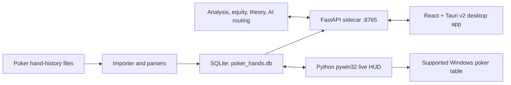

# LeakSnipe

**A local-first poker study workstation for turning hand histories into reliable statistics, replayable decisions, opponent reads, range work, and AI-assisted review.**

LeakSnipe imports poker hand histories into a local SQLite database, presents them in a modern Tauri desktop application, and connects the full review loop:

> **Track → Find → Review → Study → Improve**

The canonical application is the React/Tauri interface in `leaksnipe-ui/`, backed by the FastAPI service in `sidecar/server.py` and the Python analysis engine at the repository root. The original `poker_gui.py` desktop application remains available as a fallback and powers the primary Windows live HUD.

LeakSnipe is under active development. It currently targets Windows and BetACR/ACR tournament hand histories most heavily.

## Start here

- [Product introduction](docs/INTRODUCTION.md)
- [Theory tooling and accuracy boundaries](docs/THEORY.md)
- [Product feature audit and roadmap](docs/PRODUCT_FEATURE_AUDIT.md)

## Contents

- [Capabilities](#what-leaksnipe-does)
- [Application tour](#application-tour)
- [Architecture](#architecture)
- [Installation](#installation)
- [Live HUD setup](#live-hud-setup)
- [AI configuration and privacy](#ai-configuration-and-privacy)
- [Developer workflow](#developer-workflow)
- [Validation and tests](#validation-and-tests)
- [Troubleshooting](#troubleshooting)
- [Accuracy and scope](#accuracy-and-scope)
- [Contributing](#contributing)

## What LeakSnipe does

### Hand tracking and review

- Imports hand-history files from configured watch folders.
- Automatically discovers common BetACR/ACR hand-history locations.
- Stores hands locally in `poker_hands.db` using versioned SQLite migrations.
- Shows hero cards, board cards, result, position, pot, table, date, and tags.
- Opens hand statistics on a single click.
- Opens the detailed hand view/replayer on double-click or through **Replay**.
- Replays every street and action with an opponent-hole-card visibility toggle.
- Supports safe re-imports and incremental background watching.

### Statistics and opponent analysis

- Tracks VPIP, PFR, aggression factor, fold-to-c-bet, WTSD, and 3-bet statistics.
- Breaks opponent VPIP/PFR down by UTG, MP, HJ, CO, BTN, SB, and BB positions.
- Persists indexed positional facts instead of recomputing every HUD request.
- Shows sample sizes alongside percentages.
- Provides player classification, leak alerts, and position-level summaries.
- Refreshes opponent HUD data on focus and during longer review sessions.

### Live Windows HUD

- Uses the original Python/pywin32 overlay for the primary live HUD.
- Anchors overlays to supported ACR tournament table windows.
- Rotates seats around the hero and adapts as players join, leave, or switch tables.
- Shows readable opponent badges and position-specific VPIP/PFR.
- Supports locked click-through mode, unlocked dragging, persistent offsets, and reset controls.
- Hides when no matching poker table is present.

The Tauri transparent overlay remains experimental. Do not run both HUD implementations simultaneously.

### AI-assisted analysis

- Produces street-by-street hand review grounded in parsed actions and computed facts.
- Supports session analysis, coaching chat, local memory, and database-query tools.
- Uses ASI:One as the preferred provider when configured.
- Supports separate ASI:One keys for hand analysis and coach/chat concurrency.
- Supports OpenAI, Gemini, Anthropic, DeepSeek, and optional local Ollama alternatives.
- Makes web research optional: **Off**, **On-demand**, or **Always**.
- Keeps routine hand analysis and simple statistics local unless a provider call is requested.

AI explanations are not used as a substitute for poker math. Equity percentages are computed by the local engine.

### Equity, pot odds, and theory

- Monte Carlo equity for:
  - No-Limit Hold'em
  - Omaha Hi-Lo 8-or-better
  - Seven-card stud
  - Seven-card stud hi-lo
- Multi-way pot-odds calculations.
- Tournament ante support in theory inputs.
- CFR+ experiments for small exact or abstracted poker games.
- Lightweight neural value estimates trained from computed samples.
- Stack-depth charts at 5, 10, 25, 35, 50, 75, and 100 BB.
- Range Studio with predefined charts, editable 13×13 matrices, mixed frequencies, custom action colors, comparison, and local chart persistence.

See [docs/THEORY.md](docs/THEORY.md) for the important distinction between exact equity, abstracted CFR strategy, approximated charts, and AI explanation.

## Application tour

| Area | Purpose |
|---|---|
| **Hands** | Browse imported hands, inspect board cards and results, open opponent statistics, and replay a hand. |
| **Stats** | Review aggregate and positional performance, sample sizes, and leak alerts. |
| **AI Coach** | Analyze sessions or hands, ask grounded questions, and optionally request cited web research. |
| **Equity** | Run local Monte Carlo calculations across supported poker variants. |
| **Theory** | Explore CFR+, neural values, stack charts, and Range Studio. |
| **Settings** | Configure hero aliases, watch folders, AI routing, HUD behavior, and runtime diagnostics. |

## Architecture



The split is intentional:

- **Rust/Tauri** owns the desktop shell, process supervision, and native commands.
- **React/TypeScript** owns the primary application interface.
- **FastAPI/Python** exposes the existing poker engine through a local HTTP API.
- **SQLite** remains the local source of truth and requires no database server.
- **Python/pywin32** owns the production live-table overlay.

The local sidecar listens on `127.0.0.1:8765`. Tauri can supervise it directly or reuse the launcher-managed process.

## Repository layout

| Path | Role |
|---|---|
| `leaksnipe-ui/` | Canonical React + Tauri v2 desktop application. |
| `leaksnipe-ui/src-tauri/` | Rust process supervision, Tauri commands, ACL, and experimental overlay support. |
| `sidecar/server.py` | FastAPI application and local REST API. |
| `models.py` | Hand model, SQLite access, and persistence integration. |
| `db_migrations.py` | Versioned schema migrations and positional-fact reconciliation. |
| `parsers.py`, `importing.py` | Site parsing, hand discovery, imports, and background watching. |
| `analysis.py` | Player statistics, leak analysis, and analysis facts. |
| `equity.py`, `pot_odds.py` | Local poker math engines. |
| `ai_processor.py` | AI provider routing, tools, prompts, and grounded analysis. |
| `coach_memory.py`, `dataset_context.py`, `web_context.py` | Coach memory and optional context sources. |
| `theory/` | CFR+, charts, and neural value tooling. |
| `poker_gui.py` | Maintained CustomTkinter fallback and primary Python live HUD. |
| `scripts/` | Install, launch, supervision, and developer PowerShell scripts. |
| `tests/` | Python regression and theory tests. |
| `docs/` | Product, architecture, and theory documentation. |
| `leak-snipe-desktop/`, `PokerBuild/` | Older/incomplete experiments; not the canonical app. |

## Requirements

LeakSnipe's current desktop workflow is Windows-first.

- Windows 10 or 11
- Python 3.11 or newer
- Node.js 20.19+ (or a current Node.js 22 release)
- Rust stable toolchain
- Visual Studio 2022 Build Tools with the **Desktop development with C++** workload
- Microsoft Edge WebView2 Runtime
- Git

For the live HUD:

- A supported Windows poker client and table window
- `pywin32` installed in the repository `.venv` by the sidecar installer

Cloud AI is optional. Hand import, browsing, statistics, replay, equity, and local theory tooling do not require an API key.

## Installation

### 1. Clone the repository

```powershell
git clone https://github.com/JohnDaWalka/LeakSnipe.git
cd LeakSnipe
```

### 2. Install the Python sidecar

Double-click:

```text
Install-Sidecar.bat
```

This creates a repository-local `.venv`, installs `sidecar/requirements.txt`, and installs the root Python package. Do not install from `C:\Windows\System32` or mix it with another project's virtual environment.

### 3. Configure optional AI providers

```powershell
Copy-Item .env.example .env
```

Edit `.env` and replace only the providers you intend to use. Never commit this file.

Recommended ASI:One configuration:

```dotenv
ASI_ONE_API_KEY=your-primary-key
ASI_ONE_API_KEY_FALLBACK=your-optional-second-key
ASI1_MODEL=asi1
```

The primary key is used for hand analysis. When present, the fallback key is used for coach/chat work so both workloads can run concurrently. Supported model names are `asi1`, `asi1-ultra`, and `asi1-mini`.

Alternative provider variables are documented in `.env.example`.

### 4. Launch LeakSnipe

Double-click:

```text
Launch-LeakSnipe.bat
```

The launcher:

1. Starts or reuses the sidecar on port `8765`.
2. Installs missing npm packages on the first run.
3. Loads the Visual C++ build environment when available.
4. Starts the Tauri development desktop application.

The first Rust build may take several minutes.

### 5. Configure hand histories

In **Settings**:

1. Add the hero name used by each poker site.
2. Confirm or add the hand-history watch folder.
3. Save settings.
4. Run a manual scan if existing hands do not appear immediately.

For BetACR, histories are commonly stored under:

```text
C:\ACR Poker\handHistory\<username>
```

## Live HUD setup

1. Start LeakSnipe and confirm the sidecar is healthy.
2. Open a supported ACR tournament table.
3. In Settings, keep **Live HUD backend** set to **Python**.
4. Launch the HUD from Settings or double-click `Launch-Python-Hud.bat`.
5. Use **Unlock HUD** or `Ctrl+Shift+H` to reposition badges.
6. Lock the HUD for click-through play.

HUD logs:

```text
%TEMP%\leaksnipe_python_hud.log
%TEMP%\leaksnipe_python_hud.err.log
```

Do not run the Python HUD and experimental Tauri overlay together.

Poker-site rules concerning trackers, HUDs, and real-time assistance vary. You are responsible for using LeakSnipe only where the relevant site rules and local law permit it.

## AI configuration and privacy

Provider preference is configured in **Settings → AI provider**. LeakSnipe prefers ASI:One when an ASI:One key is present; it does not silently switch to Ollama merely because Ollama is running.

Web-search modes:

| Mode | Behavior |
|---|---|
| **Off** | Never request web context. |
| **On-demand** | Search only when the user explicitly requests research or current sources. |
| **Always** | Allow web context for coach requests. |

Local data stays on the machine unless a feature explicitly sends context to a configured AI or web provider. Review provider privacy policies before enabling cloud analysis.

After changing `.env`, use **Settings → Refresh** or:

```powershell
Invoke-RestMethod -Method Post http://127.0.0.1:8765/api/ai/reload
```

A complete LeakSnipe restart remains the safest way to ensure every process receives new environment values.

## Data and migrations

Default local data files:

| File | Contents |
|---|---|
| `poker_hands.db` | Imported hands, actions, players, tags, cached player types, and positional facts. |
| `coach_memory.db` | Local AI coach memory. |
| `settings.json` | Local application settings and HUD positions. |

`db_migrations.py` applies versioned, idempotent migrations at startup. It also reconciles missing positional facts after rolling restarts. SQLite uses WAL mode and a busy timeout so the sidecar and Python HUD can safely share the local database.

Back up `poker_hands.db` before manually editing it. API keys belong only in `.env`, never in the database or `settings.json`.

## Developer workflow

### Start the complete desktop development environment

```powershell
powershell -ExecutionPolicy Bypass -File scripts\tauri-dev.ps1
```

### Start only the sidecar

```powershell
.\Start-Sidecar.bat
```

Then inspect:

- Health: <http://127.0.0.1:8765/health>
- Diagnostics: <http://127.0.0.1:8765/api/diagnostics>
- FastAPI documentation: <http://127.0.0.1:8765/docs>

### Run the fallback desktop application

```powershell
.\.venv\Scripts\python.exe poker_gui.py
```

### Run the Python HUD directly

```powershell
.\.venv\Scripts\python.exe poker_gui.py --live-hud
```

## Validation and tests

Run from the repository root unless noted otherwise.

### Python

```powershell
.\.venv\Scripts\python.exe -m unittest discover -s tests -p "test_*.py"
```

### React production build

```powershell
cd leaksnipe-ui
npm run build
```

### Rust/Tauri check

```powershell
cd leaksnipe-ui\src-tauri
cargo check
```

### Package the desktop app

```powershell
cd leaksnipe-ui
npm run tauri build
```

## Local API overview

FastAPI exposes interactive schemas at `/docs`. Important routes include:

| Method | Endpoint | Purpose |
|---|---|---|
| `GET` | `/health` | Lightweight sidecar health and runtime identity. |
| `GET` | `/api/diagnostics` | Database schema, process, version, and path diagnostics. |
| `GET` | `/api/hands` | Paginated imported hands. |
| `GET` | `/api/hands/{hand_id}` | Complete hand detail and replay data. |
| `GET` | `/api/players/{name}/stats` | Overall and positional opponent statistics. |
| `POST` | `/api/import/scan` | Scan configured hand-history folders. |
| `GET` | `/api/ai/status` | Non-secret AI routing status. |
| `POST` | `/api/ai/reload` | Reload `.env` and provider configuration. |
| `POST` | `/api/analyze/hand` | Grounded street-by-street hand analysis. |
| `POST` | `/api/chat` | AI coach conversation. |
| `POST` | `/api/equity` | Hold'em Monte Carlo equity. |
| `POST` | `/api/equity/omaha8` | Omaha Hi-Lo equity. |
| `POST` | `/api/equity/stud` | Seven-card stud equity. |
| `POST` | `/api/equity/stud8` | Stud hi-lo equity. |
| `GET` | `/api/theory/charts` | Stack-depth chart data. |
| `POST` | `/api/theory/cfr` | Run a supported CFR+ subgame. |

## Troubleshooting

### The app says the sidecar is offline

Run `Start-Sidecar.bat`, then check:

```text
%TEMP%\leaksnipe_sidecar.log
```

Use **Settings → Refresh diagnostics** to confirm process ownership, API PID, schema version, database path, and migration status.

### Hands are blank or the UI reports “failed to fetch”

This usually means port `8765` is not healthy; it does not normally mean hand data was deleted. Check `/health`, restart the sidecar, and verify that diagnostics point to the repository-local `poker_hands.db`.

### Opponent position percentages are missing

1. Confirm diagnostics show the current database schema version.
2. Click **Refresh diagnostics**.
3. Restart the sidecar to trigger positional-fact reconciliation.
4. Refresh player statistics or reopen the hand.

### AI reports a connection failure

Use **Settings → Test provider**. A final local Ollama refusal can otherwise obscure an earlier cloud-provider rate limit. Confirm the selected provider, model, key detection, and rate-limit message in the sidecar log.

### The Python HUD does not appear

- Confirm an eligible ACR table—not the lobby or LeakSnipe window—is open.
- Confirm only one HUD backend is running.
- Check the Python HUD log and error log.
- Reset saved seat positions from Settings.
- Verify `pywin32` is installed in `.venv` by rerunning `Install-Sidecar.bat`.

### Port 1420 is already in use

Close stale LeakSnipe/Vite windows and rerun `Launch-LeakSnipe.bat`. The development launcher safely clears recognized stale LeakSnipe Vite listeners but will not terminate unrelated applications.

## Accuracy and scope

LeakSnipe distinguishes these data sources throughout the product:

- **Parsed facts:** cards, actions, stacks, pots, positions, and outcomes from hand histories.
- **Computed math:** equity, pot odds, statistics, and deterministic classifications.
- **Solver output:** CFR+ results for explicitly supported games and abstractions.
- **Approximations:** charts or value estimates labeled as approximate.
- **AI explanation:** natural-language interpretation grounded in the above sources.

LeakSnipe does not claim to provide a full no-limit hold'em equilibrium solver. It must not label LLM-generated numbers as equity, EV loss, or GTO frequencies.

## Contributing

1. Keep the canonical Tauri/FastAPI architecture intact.
2. Preserve `poker_gui.py` as a working fallback and primary Python HUD.
3. Never commit API keys, `.env`, local databases, local settings, generated reports, or model weights.
4. Add regression tests for parser, persistence, statistics, equity, and migration changes.
5. Keep poker-math outputs deterministic or simulation-backed and expose sample sizes/provenance.
6. Do not broaden solver claims beyond tested coverage.
7. Run the Python suite, frontend build, and Rust check before opening a pull request.

## Roadmap

The current roadmap focuses on:

- database-backed hand filters and saved reports
- review-to-study links from a hand into the nearest covered range
- drill generation and progress history
- board-texture aggregate reports
- larger but explicitly abstracted solver coverage
- optional service/database scaling after local correctness is established

See [docs/PRODUCT_FEATURE_AUDIT.md](docs/PRODUCT_FEATURE_AUDIT.md) for the detailed competitive analysis and implementation sequence.

## License

No license file is currently included in this repository. Unless the maintainer adds one, the source is publicly visible but no open-source license is granted.

## Maintainer

- GitHub: [JohnDaWalka](https://github.com/JohnDaWalka)
- Repository: [JohnDaWalka/LeakSnipe](https://github.com/JohnDaWalka/LeakSnipe)
